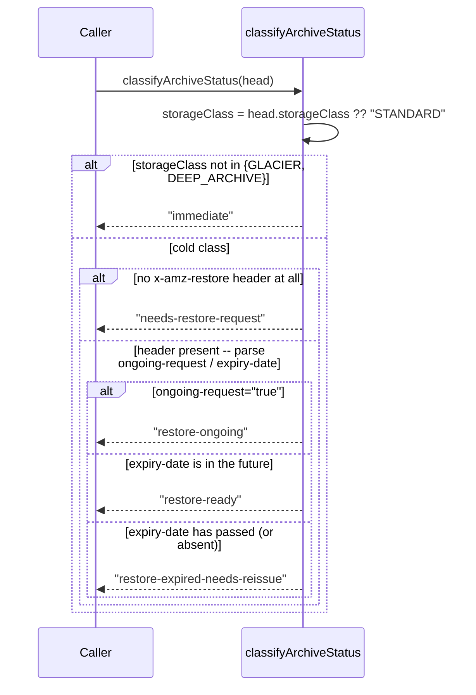

# Flow: archive status classification and the restore dance

**Derived from:** `src/s3/archive-status.ts`, `src/s3/storage-class-actions.ts`

**Used by:** [`materialize.md`](materialize.md), [`converge_status.md`](converge_status.md),
[`mirror.md`](mirror.md) (`mirror catchup`'s `--allow-download` path)

`classifyArchiveStatus` is a **pure function** — no I/O, given only a HEAD response's `StorageClass`
and `x-amz-restore` header — that turns S3's own archive/restore state into one of five values. Every
command that might touch a `GLACIER`/`DEEP_ARCHIVE` object calls it identically; only what each command
_does_ with the result differs.

## Sequence



**What each caller does with each status:**

```mermaid
sequenceDiagram
    participant Materialize as materialize
    participant ConvergeStatus as converge / status
    participant Catchup as mirror catchup

    note over Materialize,Catchup: "immediate" or "restore-ready"
    Materialize->>Materialize: download + decrypt now
    ConvergeStatus->>ConvergeStatus: decideStorageClassAction -> "already-correct"<br/>(colder target: "immediate-copy" instead, no archive status involved)<br/>(warmer target, ready: "finalize-copy")
    Catchup->>Catchup: download to the mirror now

    note over Materialize,Catchup: "needs-restore-request" or "restore-expired-needs-reissue"
    alt --request-retrieval / apply given
        Materialize->>Materialize: RestoreObject(days: 7, tier: Standard); count as requested
        ConvergeStatus->>ConvergeStatus: decideStorageClassAction -> "needs-restore-request";<br/>if apply: RestoreObject
        Catchup->>Catchup: RestoreObject; count as requested
    else flag/apply not given
        Materialize->>Materialize: count as needsRetrieval, no call
        ConvergeStatus->>ConvergeStatus: count only, no call
        Catchup->>Catchup: count as archivedNotRequested, no call
    end

    note over Materialize,Catchup: "restore-ongoing"
    Materialize->>Materialize: count as pending, no call
    ConvergeStatus->>ConvergeStatus: decideStorageClassAction -> "restore-ongoing"; count only
    Catchup->>Catchup: count as restorePending, no call
```

## Notes

- **Concurrency:** the classification itself is synchronous and free; the HEAD that supplies its input
  runs inside whichever pool the caller already uses (see [`flow-pool-dispatch.md`](flow-pool-dispatch.md)).
- **On failure:** none of these states are errors — even "the object needs a restore that costs money and
  takes hours to days" is reported, not thrown. The only real failure mode is a HEAD finding no object at
  all, which every caller treats as `CorruptionError` before classification is ever reached.
- **A restore is never free or instant.** `RESTORE_DAYS = 7`, tier `Standard` — the temporary readable
  copy a restore produces lasts a week, and Standard tier costs less but can take up to 12 hours on
  `GLACIER` and up to 48 on `DEEP_ARCHIVE`. Every caller that can request one gates it behind an explicit
  flag (`materialize --request-retrieval`, `converge`'s `--apply`, `mirror catchup --request-retrieval`)
  rather than ever doing it implicitly.
- **Testing asymmetry, worth knowing when reading the tests:** LocalStack does not simulate real
  archive-tier timing at all — it accepts the restore API calls but never actually transitions an object
  from `restore-ongoing` to `restore-ready`. So the four-way classification logic itself is exhaustively
  unit-tested against fabricated HEAD responses (`test/unit/s3/archive-status.test.ts`), while the e2e
  suite only ever exercises the `"immediate"` path plus asserting the right API calls are issued for the
  others — it can't observe a real restore actually completing.
- **`converge`/`status` alone also handle a _colder_ target**, which needs no archive status at all: any
  move to a colder class is always a plain, immediate self-copy (`isColderTarget`), independent of
  whatever state the object happens to already be in.
- **Sub-flows:** none — this is a leaf classification, consumed identically everywhere.
