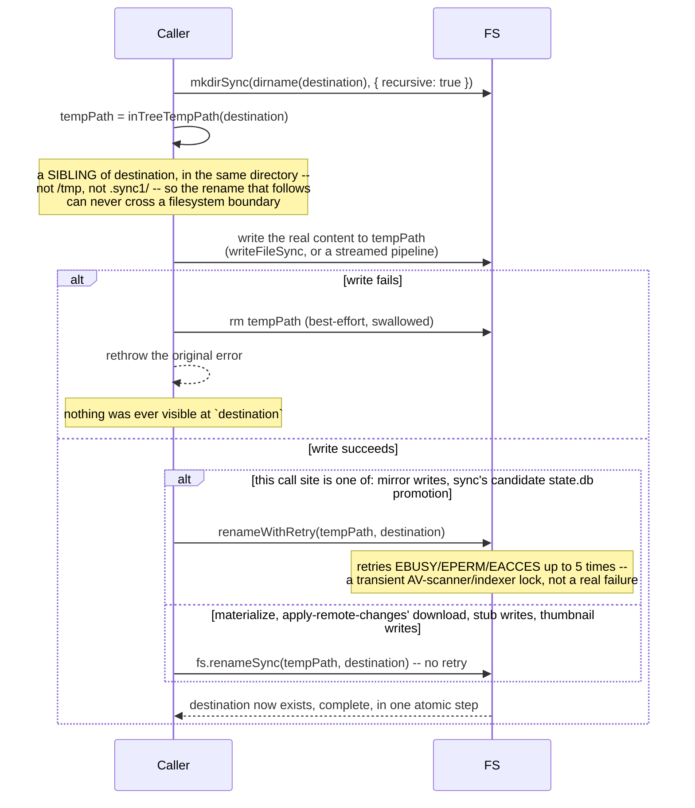

# Flow: atomic publish (temp sibling → rename)

**Derived from:** `src/fs/temp-path.ts`, `src/fs/safe-fs.ts`, `src/fs/mirror-sink.ts`, `src/fs/stub.ts`

**Used by:** [`materialize.md`](materialize.md), [`thumbnail.md`](thumbnail.md),
[`mirror.md`](mirror.md), [`stubify.md`](stubify.md), [`flow-mirror-metadata.md`](flow-mirror-metadata.md)

Every place this codebase writes a file that must never be observed half-written — a materialized
original, a generated thumbnail, a mirrored object, a stub — uses the same two-step idiom: write to a
throwaway name, then `rename` it onto the real destination. A `rename` within one filesystem is atomic
at the OS level, so a reader can only ever see the old file or the new one, never a partial write.

## Sequence

## Notes

- **Concurrency:** none — this is always one file's own write, awaited inline by whatever pool job is
  producing it. The concurrency, where it exists, is in how many _different_ files' publishes run at
  once (one per pool slot), not within a single publish.
- **On failure:** a failed write leaves only the temp file, never a partial destination — the cleanup
  removes it, and the original error propagates unchanged. `sanity_check` is what finds a temp file that
  survived anyway (the process was killed between the write and the rename, which is a `process.exit()`
  path that skips every `finally` — see [`flow-preamble.md`](flow-preamble.md)); it never auto-deletes
  one, only reports it with its size, since removal is a human decision once no sync1 command is
  running.
- **Why the temp must be a _sibling_, specifically:** `inTreeTempPath` (`src/fs/temp-path.ts`) derives
  the temp name from the destination's own directory, deliberately never from a fixed staging area like
  `/tmp` or `.sync1/`. A mirror or a materialize destination can be on a different filesystem or network
  mount than anywhere else in the process; a temp written elsewhere would make the "atomic rename" into a
  cross-filesystem _copy_, which is not atomic at all and can leave a truncated file visible mid-copy.
- **The temp name itself is synthesized, not derived by extending the destination's.** 128 random bits
  plus (where a tool needs it) the destination's extension, at a _constant_ length — not the
  destination's name with a suffix appended, which was tried first and failed in practice: a
  239-byte thumbnail name became a 258-byte staging name, past the 255-byte filesystem limit, and
  generation failed forever for that one file. `isInTreeTempName` recognizes exactly this shape, which
  is what lets a directory walker exclude every in-flight temp from being mistaken for real content.
- **`renameWithRetry` is not used at every one of these call sites, and the split is worth knowing.**
  Only mirror writes (`mirror-sink.ts`, `mirror-ops.ts`) and sync's candidate `state.db` promotion
  (`commit.ts`) go through it — both are renames that may target a network mount or an external drive,
  where a transient Windows antivirus/indexer lock (`EBUSY`/`EPERM`/`EACCES`) is a real, recoverable
  possibility worth five attempts of exponential backoff for. `materialize.ts`, `apply-remote-changes.ts`'s
  own download path, `stub.ts`'s `writeStubAtomic`, and `thumbnail.ts` all call a bare `fs.renameSync`
  instead — ordinary local-filesystem writes, where this codebase has not judged the same retry worth
  adding. All of them still share `inTreeTempPath` (or, for a name that must preserve its destination's
  extension, `inTreeTempPathPreservingExtension`) for the temp itself.
- **Sub-flows:** none — this is a leaf idiom.
