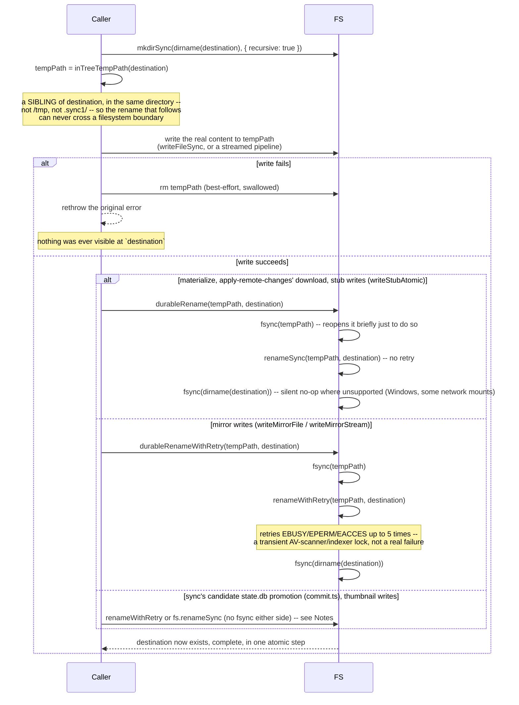

# Flow: atomic publish (temp sibling → rename)

**Derived from:** `src/fs/temp-path.ts`, `src/fs/safe-fs.ts`, `src/fs/durable.ts`,
`src/fs/mirror-sink.ts`, `src/fs/stub.ts`

**Used by:** [`materialize.md`](materialize.md), [`thumbnail.md`](thumbnail.md),
[`mirror.md`](mirror.md), [`stubify.md`](stubify.md), [`flow-mirror-metadata.md`](flow-mirror-metadata.md),
[`flow-apply-remote-changes.md`](flow-apply-remote-changes.md)

Every place this codebase writes a file that must never be observed half-written — a materialized
original, a generated thumbnail, a mirrored object, a stub — uses the same two-step idiom: write to a
throwaway name, then `rename` it onto the real destination. A `rename` within one filesystem is atomic
at the OS level, so a reader can only ever see the old file or the new one, never a partial write.

**Atomic visibility and crash durability are two separate guarantees, and only some call sites here have
both.** A bare `fs.renameSync` (or `renameWithRetry`) gives the first for free — nobody ever sees a
half-written file — but says nothing about whether either the temp file's bytes or the rename itself
survive a crash at the wrong moment: a process killed right after `write()` returns, before the OS has
actually flushed those bytes to disk, can leave the destination truncated or zero-length once the rename
does land; and on some filesystems (ext4 without `dirsync`, most notably) even a _completed_ rename's
directory-entry change can itself be rolled back by crash recovery if it was never `fsync`'d. `src/fs/
durable.ts`'s `durableRename`/`durableRenameWithRetry` close both gaps — `fsync` the temp file, rename,
then `fsync` the destination directory — and are used at exactly the call sites where a lost write
would either destroy the only local copy of something already believed backed up, or corrupt a file the
mirror's own existence check trusts forever.

## Sequence

## Notes

- **Concurrency:** none — this is always one file's own write, awaited inline by whatever pool job is
  producing it. The concurrency, where it exists, is in how many _different_ files' publishes run at
  once (one per pool slot), not within a single publish.
- **On failure:** a failed write leaves only the temp file, never a partial destination — the cleanup
  removes it, and the original error propagates unchanged. `sanity_check` is what finds a temp file that
  survived anyway (the process was killed between the write and the rename, which is a `process.exit()`
  path that skips every `finally` — see [`flow-preamble.md`](flow-preamble.md)); it never auto-deletes
  one, only reports it with its size, since removal is a human decision once no sync1 command is
  running.
- **Why the temp must be a _sibling_, specifically:** `inTreeTempPath` (`src/fs/temp-path.ts`) derives
  the temp name from the destination's own directory, deliberately never from a fixed staging area like
  `/tmp` or `.sync1/`. A mirror or a materialize destination can be on a different filesystem or network
  mount than anywhere else in the process; a temp written elsewhere would make the "atomic rename" into a
  cross-filesystem _copy_, which is not atomic at all and can leave a truncated file visible mid-copy.
- **The temp name itself is synthesized, not derived by extending the destination's.** 128 random bits
  plus (where a tool needs it) the destination's extension, at a _constant_ length — not the
  destination's name with a suffix appended, which was tried first and failed in practice: a
  239-byte thumbnail name became a 258-byte staging name, past the 255-byte filesystem limit, and
  generation failed forever for that one file. `isInTreeTempName` recognizes exactly this shape, which
  is what lets a directory walker exclude every in-flight temp from being mistaken for real content.
- **Retry and durability are independent choices at each call site, and the actual split doesn't line up
  along one axis:**

  |                           | fsync'd (durable)                                                                                    | not fsync'd                                                                         |
  | ------------------------- | ---------------------------------------------------------------------------------------------------- | ----------------------------------------------------------------------------------- |
  | **retried on EBUSY/etc.** | mirror writes (`mirror-sink.ts`, via `durableRenameWithRetry`)                                       | sync's candidate `state.db` promotion (`commit.ts`, still a bare `renameWithRetry`) |
  | **not retried**           | materialize, apply-remote-changes' download, `stub.ts`'s `writeStubAtomic` (all via `durableRename`) | `thumbnail.ts`                                                                      |

  Retry answers "is this destination the kind of place (a network mount, an external drive) where a
  transient lock is a real possibility" — a question about the target's own reliability. Durability
  answers "would losing this write to a crash be a real loss" — a question about what the write
  represents. The two happen to coincide for the mirror (a network-mount target _and_ the sole other
  copy of already-committed content) and for materialize/apply-remote-changes/stubs (an ordinary local
  disk _and_ the last local copy of content otherwise only in S3), but nothing forces them to: sync's
  own candidate promotion targets the same kind of external-lock-prone path as the mirror (hence the
  retry) while representing something already safely committed to S3 moments earlier (so losing this
  one specific rename to a crash just means the next `sync` re-adopts the same version from S3 — not
  worth the extra syscalls). Thumbnails are local-only, regenerable previews with neither concern, so
  they get neither.

- **Sub-flows:** none — this is a leaf idiom.
