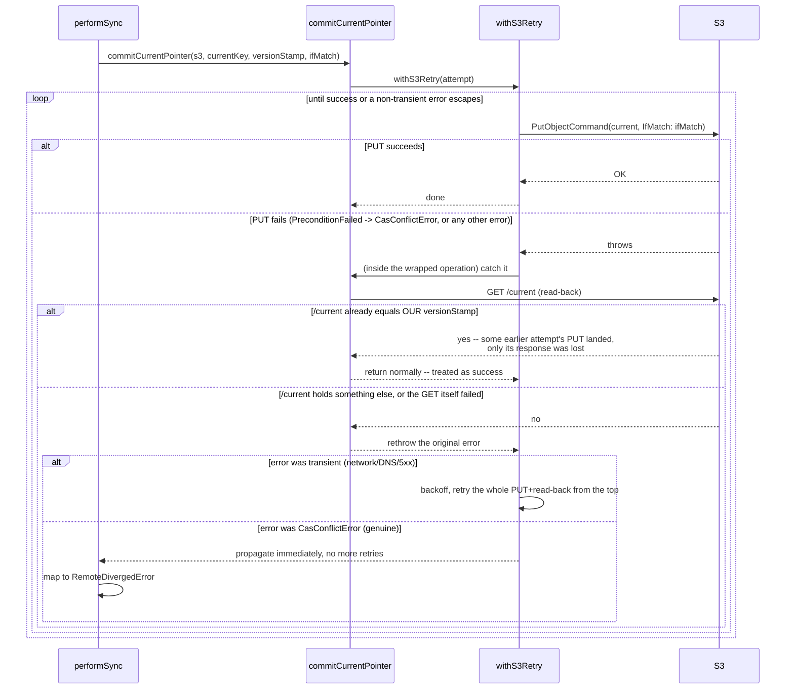

# Flow: committing `/current` — three different shapes

**Derived from:** `src/sync/commit-pointer.ts`, `src/sync/gc.ts`, `src/sync/mutate-state-db.ts`

**Used by:** [`sync.md`](sync.md) (via [`flow-candidate-db.md`](flow-candidate-db.md)), [`gc.md`](gc.md), [`policy_edit.md`](policy_edit.md)

`/current` is the one write in the whole system that is not idempotent — everything before it
(uploading objects, uploading a `states/<stamp>` snapshot) is safe to redo, but moving the pointer is the
single atomic moment a vault actually commits. Three call sites move it, and they resolve a losing race
against it in three genuinely different ways. Shown side by side rather than as three near-identical
files, because the differences are the point.

## Shape 1 — `sync`: read-back reconciliation (`commitCurrentPointer`)

`sync` has already done human-meaningful work (uploaded objects, resolved conflicts) by the time it
reaches the CAS, so a spurious conflict must not be treated as a reason to throw away and redo all of
that. Instead of retrying the CAS blindly, it asks `/current` what it actually says.



Only this run could have produced its own `versionStamp` (an ISO timestamp plus four random bytes), so
the read-back is a sound way to tell "my own PUT actually landed, I just didn't hear back" from "someone
else's commit genuinely won."

## Shape 2 & 3 — `gc` and `mutateStateDb`: five-attempt recompute loop

Both have no human conflict to resolve — a policy edit or an orphan sweep is a pure recomputation, so
losing a race is answered by doing the whole thing again against whatever `/current` now says, up to
five times.

```mermaid
sequenceDiagram
    participant Caller as gc / mutateStateDb
    participant S3
    participant Candidate as candidate.db (temp)

    loop attempt = 0 .. 4 (MAX_CAS_ATTEMPTS = 5)
        Caller->>S3: GET /current
        S3-->>Caller: versionStamp, etag (missing -> CorruptionError, no retry)
        Caller->>S3: GET states/<versionStamp>
        S3-->>Caller: encrypted snapshot (missing -> CorruptionError)
        Caller->>Caller: decryptBuffer (auth failure -> CorruptionError)
        Caller->>Candidate: fs.writeFileSync(tempSiblingPath, decrypted); openStateDb
        Caller->>Candidate: apply this call's own mutation<br/>(gc: stage+delete orphans; mutateStateDb: the `mutate` callback)
        opt gc only, and orphanCount === 0 (nothing to do)
            Caller-->>Caller: return { applied: false } -- loop never reaches the CAS at all
        end
        Caller->>Candidate: new version stamp; VersionsRepository.insert; wal_checkpoint(TRUNCATE)
        Caller->>S3: PUT states/<newVersionStamp> (plain putObject, unconditional)
        Caller->>Caller: onBeforeCas?.() -- test-only seam
        Caller->>S3: PUT /current, IfMatch: current.etag
        alt CasConflictError
            S3-->>Caller: 412
            Caller->>Caller: logger.debug("CAS conflict, refetching and recomputing")
            Caller->>Caller: continue -- next loop iteration, from GET /current again
        else success
            S3-->>Caller: OK
            note over Caller: mirror the snapshot + pointer (best-effort,<br/>see flow-mirror-metadata.md), THEN...
            Caller->>Caller: gc only: dispatch S3 deletes for staged orphans (own pool)
            Caller->>Candidate: copyFileWithRetry(candidatePath, state.db);<br/>write last_synced_version
            Caller-->>Caller: return successfully -- loop exits
        end
    end
    Caller-->>Caller: 5 attempts exhausted -> throw<br/>"too many concurrent commits"
```

## Notes

- **Concurrency:** none of the three shapes dispatch pool work for the CAS itself; `gc`'s post-CAS byte
  deletion is the one piece of real concurrency here, and it only starts after this loop's own commit has
  already succeeded (see [`gc.md`](gc.md) for that half).
- **On failure:**
  - Shape 1's non-transient failure becomes `RemoteDivergedError`, which `sync` reports as a conflict
    for the human to resolve on the next run — its dirty rows stay dirty, nothing is lost.
  - Shapes 2/3 exhausting all 5 attempts throw a plain `Error` naming the command; the caller has already
    cleaned up every candidate temp file via its own `finally` blocks by then (`fs.rmSync` each iteration).
  - **Every candidate temp DB is disposed of every iteration**, success or `continue` alike — the outer
    `finally` blocks (`if (candidateDb.open) candidateDb.close()`, then `if (existsSync) rmSync`) run on
    every path out of the `try`, including the `continue` that starts the loop over.
- **`gc`'s "0 orphans" early return is worth naming explicitly**: `applied` is reported `false` even
  when `--apply` was passed, because there was genuinely nothing to commit — the loop never reaches a
  CAS attempt at all in that case.
- **Sub-flows:** the mirror write between "CAS succeeds" and "promote local state.db" in shapes 2/3 is
  [`flow-mirror-metadata.md`](flow-mirror-metadata.md). `gc`/`mutateStateDb`'s own candidate-DB handling
  is not delegated anywhere — it's the simple single-decrypt-mutate-upload version shown directly above,
  in this same diagram. [`flow-candidate-db.md`](flow-candidate-db.md) documents the unrelated, more
  elaborate lifecycle `sync` uses instead (a separate remote-fresh fetch, two apply passes) — see that
  file for contrast, not as something this diagram calls into.
