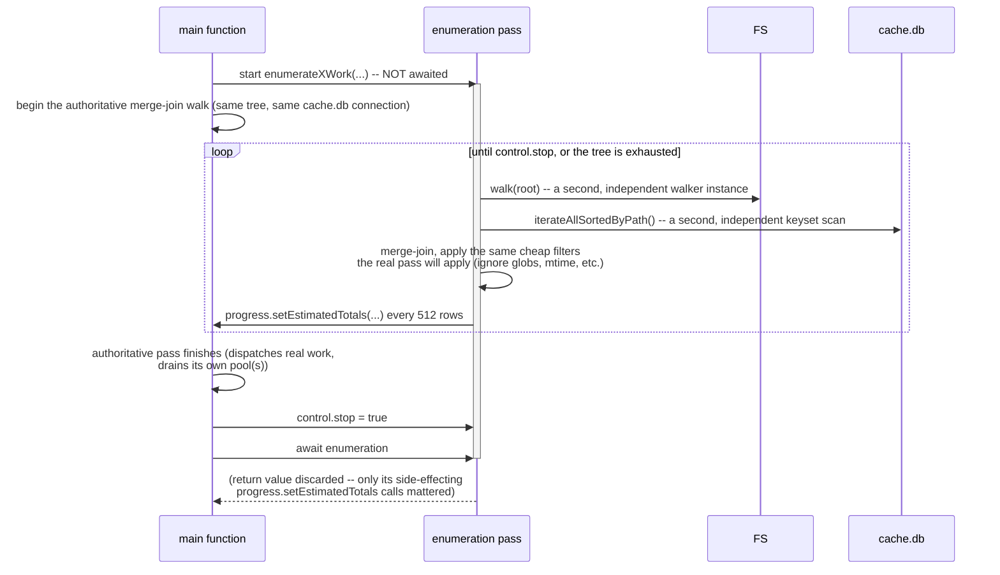

# Flow: the concurrent enumeration pass

**Derived from:** `src/fs/update-cache-enumerate.ts`, `src/fs/stubify-enumerate.ts`,
`src/fs/sanity-check-enumerate.ts`, `src/fs/thumbnail.ts` (`enumerateThumbnailWork`)

**Used by:** [`update_cache.md`](update_cache.md), [`stubify.md`](stubify.md),
[`sanity_check.md`](sanity_check.md), [`thumbnail.md`](thumbnail.md)

Four commands run a **second, independent walk** of the same tree purely to give the progress bar a
real denominator before the authoritative pass has finished discovering everything itself. It is started
and deliberately **never awaited** by the main function — it just runs concurrently on the event loop,
racing the real work, and is cancelled via a shared `control.stop` flag in the caller's `finally`.

This is a large, repeated pattern that is otherwise completely invisible: nothing in any of the four
commands' visible output distinguishes "the real scan" from "the estimate walk" — both silently touch
the same cache.db connection and the same filesystem.

## Sequence

## Notes

- **Concurrency:** genuinely concurrent with the authoritative pass, not sequential before it — both
  read the same cache.db connection and the same filesystem tree at the same time, which is safe only
  because every large scan in this codebase is keyset-paginated (never a blocking `.iterate()` cursor).
- **On failure:** **every error inside the enumeration pass is swallowed.** It exists purely to make a
  progress bar less wrong; a bug in it must never abort or even warn about the real command. If the
  authoritative pass finishes before the enumeration pass would have, the `control.stop` flag cuts it
  short mid-walk with no further effect.
- **What it does NOT do:** it never dispatches hashing, never touches S3, never writes anything. It is
  read-only observation of the same two data sources the real pass reads, computing only counts and
  byte totals via the same "would this row need work" predicate the real pass uses (kept in sync by
  hand in each of the four implementations — there is no shared helper enforcing that the two audits
  agree).
- **Sub-flows:** none.
