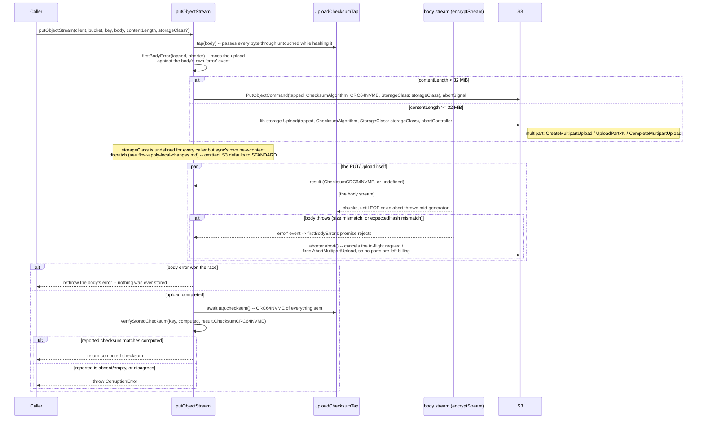

# Flow: `putObjectStream`

**Derived from:** `src/s3/client.ts`, `src/s3/checksum.ts`

**Used by:** [`flow-apply-local-changes.md`](flow-apply-local-changes.md) (sync's upload phase)

Every content-object upload goes through one function that branches on size — a single `PutObjectCommand`
below 32 MiB (`MULTIPART_THRESHOLD_BYTES`), lib-storage's `Upload` at or above it — and both paths verify
S3's own reported CRC64NVME against a value computed client-side as the ciphertext streams past, before
returning. A body that errors mid-stream (the source file changed, or its content stopped matching the
hash it is being stored under — see [`flow-encrypt-stream.md`](flow-encrypt-stream.md)) is turned into an
immediate abort, not an unhandled rejection and not a lingering socket.

## Sequence

## Notes

- **Concurrency:** the upload/PUT and the body-error watcher race each other (`Promise.race`) for the
  duration of one object's transfer; this is the only concurrency inside the function itself. The
  function as a whole is one job inside sync's `stream` pool (see
  [`flow-pool-dispatch.md`](flow-pool-dispatch.md)).
- **On failure:**
  - A body error aborts the in-flight request/multipart upload immediately via `AbortController` — the
    object is never created at S3 at all, not created-then-cleaned-up. Above the 32 MiB threshold this
    also makes lib-storage issue its own `AbortMultipartUpload`, so no orphaned parts are left for S3 to
    keep billing for.
  - A missing or mismatched reported checksum is treated as **corruption**, not a compatibility
    accommodation — a backend that doesn't implement CRC64NVME is unsupported for writing. This is a
    deliberate hardening: computing a substitute checksum locally instead (possible, since encryption is
    convergent) was considered and rejected, because it would record a value nothing at S3 actually
    corroborated while looking exactly like one that had been.
  - Without the abort-on-body-error machinery, a body error below the 32 MiB threshold used to surface
    as an **unhandled `'error'` event that killed the process** before the caller's own `try/catch`
    could see it — the run's `--json` summary was never written at all. And even once caught, the SDK's
    own request would sit waiting on a body that would never send another byte until its socket timed
    out, roughly a minute per failed object.
- **Sub-flows:** the body it streams is [`flow-encrypt-stream.md`](flow-encrypt-stream.md), which is
  where the size-mismatch and hash-mismatch aborts this diagram reacts to actually originate.
