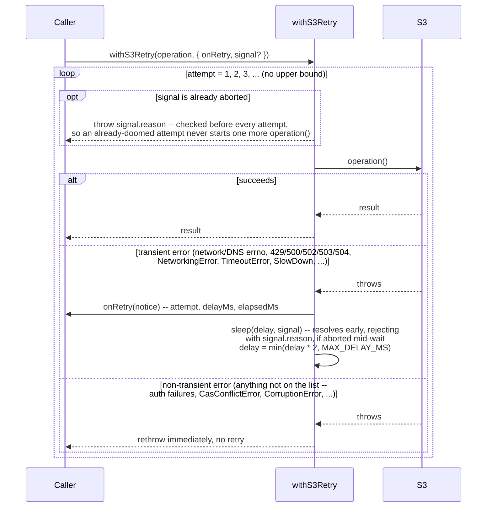

# Flow: `withS3Retry`'s unbounded backoff

**Derived from:** `src/s3/retry.ts`

**Used by:** [`sync.md`](sync.md) (via [`flow-put-object-stream.md`](flow-put-object-stream.md),
sync's upload path, and [`flow-apply-remote-changes.md`](flow-apply-remote-changes.md), its download
path), [`materialize.md`](materialize.md), and, as of the multipart storage-class copy fix,
[`converge_status.md`](converge_status.md)'s own `copyObjectStorageClass` sub-sequence (`src/s3/copy-object.ts`)
-- but only that one sub-path; see below for the rest of that command's calls.

**Deliberately not used by:** `gc.md`, `policy_edit.md`, and every _other_ call `converge_status.md`
makes (`headObject`/`restoreObject`/the at-or-below-threshold single `CopyObject`) — see below.

`withS3Retry` wraps one S3 request and retries it **forever** on a fixed set of transient AWS SDK error
names, node socket/DNS errnos, and HTTP status codes, with exponential backoff capped at a maximum
delay. There is no attempt limit: a backup tool waiting out a long outage is judged better than one that
gives up and loses hours of transfer progress. On the **download** path
([`flow-apply-remote-changes.md`](flow-apply-remote-changes.md)) the retriable unit is still an entire
read-decrypt-write, since a GET's response stream can't be replayed either. On the **upload** path it is
narrower than that now: each request inside `uploadObjectStream`
([`flow-put-object-stream.md`](flow-put-object-stream.md)) — one `PutObject`, one `UploadPart` — is its
own retriable unit, not the whole file, which is what lets a connection that drops partway through a
100 GB upload resend only the few megabytes that failed rather than the whole thing from byte zero. See
that file for why: `@aws-sdk/lib-storage`, the library this replaced, sent each part as a stream, and the
SDK's retry middleware refuses to retry any request with a streamed body.

## Sequence

## Notes

- **Concurrency:** none of its own — one caller, one operation in flight. Concurrency comes from
  whatever pool the caller itself runs inside (see [`flow-pool-dispatch.md`](flow-pool-dispatch.md)).
  `uploadObjectStream`'s multipart path runs several `withS3Retry`-wrapped `UploadPart` requests
  concurrently (bounded at 4), but each is its own independent retry loop with its own `onRetry`.
- **`signal` is the escape hatch for the unbounded case:** something else irrecoverable happened
  elsewhere (a sibling part failed for good, the mirror gave up) and this particular retry loop needs to
  stop even though it is, on its own, still succeeding eventually. Checked before every attempt and
  threaded through the backoff sleep, so an abort lands within one tick rather than at the end of the
  current (up to 30s) wait.
- **On failure:** a non-transient error propagates on the very first attempt, unchanged from before this
  wrapper existed. A transient error is invisible to the caller until either it stops happening or the
  process is killed (Ctrl-C is the intended escape hatch for "I've decided this outage isn't ending").
- **Why some callers deliberately avoid it:**
  - `gc.ts`'s CAS loop and `mutateStateDb`'s CAS loop each have their **own** bounded retry (5 attempts,
    re-fetching and recomputing from scratch on each — see
    [`flow-cas-commit.md`](flow-cas-commit.md)) with a different failure semantics: a `CasConflictError`
    means _another commit landed first_, which is answered by recomputation, not by waiting out a
    network blip. Wrapping that loop's own S3 calls in an _additional_, unbounded retry would make a
    genuinely stuck five-attempt loop indistinguishable from a healthy one still working through
    transient errors.
  - `converge`/`status`'s own `headObject`/`restoreObject` calls, and the at-or-below-threshold single
    `CopyObject`, have no retry wrapper at all — a transient failure there simply fails that one
    object's dispatched job, counted as a pool error, and the command reports what it managed before the
    failure. This is a plainer, less resilient design than sync's, and nothing in the code notes why; it
    is stated here because the asymmetry is otherwise invisible. The one exception, added with the
    multipart storage-class copy fix: once an object is large enough that `copyObjectStorageClass`
    (`src/s3/copy-object.ts`) falls back to a multipart copy, each of its own
    `CreateMultipartUpload`/`UploadPartCopy`/`CompleteMultipartUpload` requests _is_ wrapped in
    `withS3Retry`, same as the upload path's own multipart requests — a copy spanning many parts over a
    possibly-long time is exactly the case this module's unbounded-retry rationale was written for, and
    there was no reason to leave it as fragile as the rest of this command's calls once it needed
    building anyway.
- **Visibility:** because a retry loop looks identical at minute one and at minute sixty, `onRetry`
  always carries both the attempt count and elapsed time, and every caller logs it — the diagram in
  [`sync.md`](sync.md) shows exactly where those log lines land relative to the progress bar (the
  `--log` file).
- **Sub-flows:** none.
