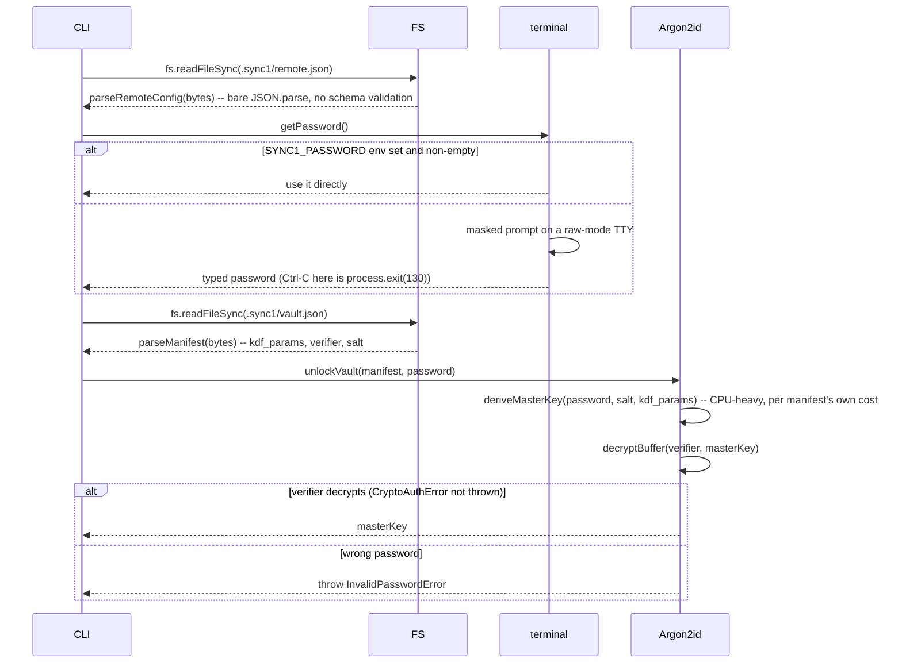

# Flow: unlock the vault

**Derived from:** `src/vault/remote-config.ts`, `src/cli/password.ts`, `src/vault/manifest.ts`,
`src/crypto/kdf.ts`

**Used by:** [`sync.md`](sync.md), [`gc.md`](gc.md), [`materialize.md`](materialize.md),
[`mirror.md`](mirror.md), [`policy_edit.md`](policy_edit.md)

Any command that reads or writes encrypted content needs the master key, derived from the vault
password via Argon2id. This is the same five-step sequence everywhere it appears; only the CPU cost of
the KDF varies with `kdf_params` recorded at `init_remote` time.

## Sequence

## Notes

- **Concurrency:** none — strictly sequential, and it runs once per command invocation, never per-item.
- **On failure:** a wrong password throws before any DB is opened or any S3 call is made; nothing has
  been read or written yet beyond `remote.json`/`vault.json`, both already-local plaintext files.
- **Cost:** the KDF step is the one deliberately expensive step in this sequence — `defaultKdfCost()` is
  Argon2id at `MODERATE`, chosen to resist offline brute-forcing of a stolen `vault.json`. It runs once
  per command, not once per file, which is why every command that touches encrypted content pays it
  exactly once regardless of how much content it then processes.
- **Sub-flows:** none.
