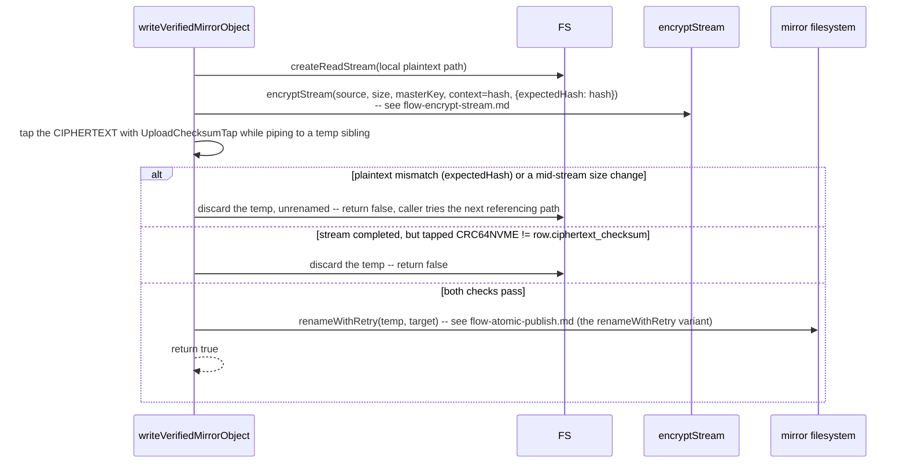

# `sync1 mirror verify|catchup|prune`

**Derived from:** `src/commands/mirror.ts`, `src/fs/mirror-ops.ts`

Three subcommands for inspecting and repairing the optional local mirror. All three share
`resolveMirror`, which resolves and requires the mirror to be **currently reachable** — refusing rather
than reporting a comforting zero when there's nothing to look at (see
[`flow-mirror-metadata.md`](flow-mirror-metadata.md)'s notes on how this differs from `sync`/`gc`'s own,
more forgiving mirror resolution). `verify` and `prune` additionally call `assertMirrorVaultMatches`
first — a different `vault.json` means the drive belongs to a _different vault entirely_, which has to
be caught before anything else, or every object would be misreported as missing/extra. All three run
after the ordinary lock/root-resolution preamble (see [`flow-preamble.md`](flow-preamble.md)), omitted
below since it never varies. `catchup` and `prune` always need the password (see
[`flow-unlock-vault.md`](flow-unlock-vault.md)) to decrypt a mirror snapshot; `verify` needs it too
except under `--quick`, which skips the object sweep entirely.

## Sequence — `mirror verify`

```mermaid
sequenceDiagram
    participant CLI as mirror verify
    participant Mirror as mirror filesystem
    participant S3
    participant Objects as mirror snapshot db (temp)

    CLI->>Mirror: resolveMirror (requireReachableMirror); assertMirrorVaultMatches(vault.json)
    CLI->>Mirror: readMirrorVersion -- current pointer, then confirm its named snapshot<br/>actually exists and is non-empty (fatal, named explicitly, if not)
    alt --offline
        CLI->>CLI: referenceVersion = local last_synced_version
    else default
        CLI->>S3: GET /current
    end
    CLI->>CLI: upToDate = referenceVersion === mirrorVersion
    CLI->>Mirror: countOf(walkMirrorTemps) -- orphaned .sync1-tmp-* files

    alt --quick
        CLI-->>CLI: return -- no password, no object sweep at all
    else full sweep (needs the password)
        CLI->>Objects: openMirrorSnapshot(mirrorVersion) -- decrypt the MIRROR's own snapshot,<br/>not local state.db, into a temp db
        CLI->>Mirror: verifyMirrorObjects(depth) -- see below
        CLI->>Mirror: findExtraMirrorObjects -- objects on disk this snapshot doesn't reference
    end
```

`verifyMirrorObjects(depth)`, per object row: `fs.statSync(target)` missing → `missing++`; wrong size →
`wrongSize++`; `depth === "checksum"` → re-read the whole file, tap its CRC64NVME, compare against the
**S3-corroborated** `ciphertext_checksum` recorded at upload time → mismatch → `checksumMismatch++`.

`ok` is `false` only when `missing + wrongSize + checksumMismatch > 0` (`--quick`: only when stale temps
exist) — `extra` is never a failure (see Notes).

## Sequence — `mirror catchup`

```mermaid
sequenceDiagram
    participant CLI as mirror catchup
    participant S3
    participant Mirror as mirror filesystem
    participant Cache as cache.db (read-only)
    participant Objects as mirror snapshot db (temp)

    CLI->>S3: GET /current (unconditional, no --allow-download gate -- metadata is<br/>megabytes, not the hundreds of GB this flag exists to gate)
    opt mirror/vault.json missing
        CLI->>Mirror: writeMirrorFile(vault.json) -- metadataFetched++
    end
    opt mirror snapshot for this version missing
        CLI->>S3: GET states/<versionStamp>
        CLI->>Mirror: writeMirrorFile(snapshot) -- metadataFetched++
    end
    note over CLI: deliberately NOT backfilling older snapshots --<br/>gc already made them partially dangling in S3
    CLI->>Mirror: writeMirrorFile(current pointer, versionStamp)
    CLI->>Objects: openMirrorSnapshot(versionStamp)

    loop every object row in the mirror's own snapshot
        alt already present on the mirror at the right size
            CLI->>CLI: alreadyPresent++
        else recoverFromLocalSources succeeds -- see below
            CLI->>CLI: recovered++
        else --allow-download not given
            CLI->>CLI: unrecoverableLocally++ (warned, names --allow-download)
        else
            CLI->>S3: headObject(key)
            CLI->>CLI: classifyArchiveStatus(head) -- see flow-archive-status.md
            alt immediate or restore-ready
                CLI->>S3: getObjectStream; downloadObjectToMirror (verified against ciphertext_checksum)
                CLI->>CLI: downloaded++ (or unrecoverableLocally++ if checksum mismatch)
            else restore-ongoing
                CLI->>CLI: restorePending++
            else needs-restore-request / restore-expired-needs-reissue
                alt --request-retrieval
                    CLI->>S3: restoreObject(days:7, tier:Standard)
                    CLI->>CLI: restoreRequested++
                else
                    CLI->>CLI: archivedNotRequested++
                end
            end
        end
    end
```

`recoverFromLocalSources(row)`: for every local path referencing this hash (dedup: several may) whose
cache row is `unchanged` (cheap, near-certain filter) and whose real file exists at the right size (a
stub fails this trivially) → `writeVerifiedMirrorObject` — see below. Tries every matching path, not
just the first, since one may still hold the original bytes while another was edited since.

`ok` is `false` only when `unrecoverableLocally > 0` — a pending or unrequested restore reads as "come
back later," the same as `materialize`.

## Sequence — `writeVerifiedMirrorObject` (catchup's local-recovery path)



**Two independent proofs, not one.** BLAKE2b (via `expectedHash`) proves the right plaintext was
encrypted; CRC64NVME (via the tap) proves the resulting bytes match what S3 itself corroborated at
upload time. Either failing discards the temp unrenamed — without this, a since-edited local path could
silently write wrong-content ciphertext under the right object's hash.

## Sequence — `mirror prune`

```mermaid
sequenceDiagram
    participant CLI as mirror prune
    participant Mirror as mirror filesystem
    participant Objects as mirror snapshot db (temp)

    CLI->>Mirror: assertMirrorVaultMatches; readMirrorVersion
    CLI->>Objects: openMirrorSnapshot(mirrorVersion)
    loop findExtraMirrorObjects -- a generator, never materialized as a set
        CLI->>CLI: count++; bytes += file.size
        opt --apply
            CLI->>Mirror: fs.rmSync(file.absolutePath, {force:true})
        end
    end
```

Always `ok: true` — pruning (or counting what pruning would remove) has no failure mode of its own.

## Notes

- **Concurrency:** none of the three subcommands dispatch pool work — every walk here
  (`walkMirrorObjects`, `walkMirrorTemps`, `findExtraMirrorObjects`) is a synchronous generator, and
  every S3 call is awaited inline. This command is bounded by disk I/O and, for `catchup`'s download
  path, plain sequential network egress — not by concurrency the way `sync`/`materialize` are.
- **`extra` is never a failure, in `verify` or `prune`.** `gc`'s scope is the current live state, so an
  object it removes from S3 legitimately survives on the mirror — that persistence _is_ the mirror's
  value as a safety net against a mistaken delete. `prune` is the separate, opt-in decision to reclaim
  that space.
- **`verify` judges completeness against the mirror's _own_ snapshot, never local `state.db`.** The
  question is "is this drive, by itself, a complete and restorable copy?", not "does it agree with this
  machine" — measuring against local state would read a legitimately-behind mirror as an unexplained
  heap of missing objects, or measure against a broken ruler if local state were itself corrupt.
- **`catchup`'s recovery ladder is ordered by cost:** already-present (free) → recoverable from local
  plaintext (free, since encryption is convergent) → download from S3 (costs egress, gated behind
  `--allow-download`) → request a restore for an archived object (costs retrieval fees and hours-to-days,
  gated behind `--request-retrieval`). Each rung is tried only after the previous one is confirmed
  unavailable.
- **On failure:** `MirrorCheckError` (a mismatched `vault.json`, a missing/empty snapshot the current
  pointer names, a missing `/current` in S3) fails the whole command outright — these are exactly the
  failures the plan calls "most likely to go unnoticed and the one that invalidates every later result,"
  so they're checked first and reported distinctly rather than manifesting as thousands of misleading
  per-object rows.
- **Sub-flows:** [`flow-encrypt-stream.md`](flow-encrypt-stream.md) (the re-encryption in
  `writeVerifiedMirrorObject`), [`flow-atomic-publish.md`](flow-atomic-publish.md) (every mirror write —
  the `renameWithRetry` variant), [`flow-archive-status.md`](flow-archive-status.md) (`catchup`'s
  fallback-to-S3 restore ladder).
