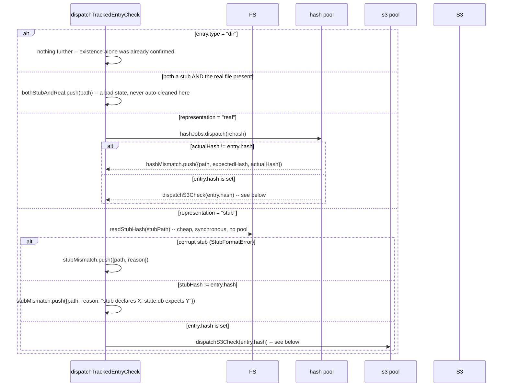

# `sync1 sanity_check`

**Derived from:** `src/commands/sanity_check.ts`, `src/fs/sanity-check.ts`

Read-only diagnostic: cross-checks `state.db` against S3 and the local filesystem for bugs, **never
repairs anything**. Structurally the same streaming merge-join as `update_cache`, but where that command
silently repairs what it finds, this one only reports — surfacing exactly the class of problem
`update_cache`/`materialize` would otherwise fix without a trace, or never notice at all (a corrupt
stub, a tampered file, an entry whose object vanished from S3, an untracked file). Needs no password —
HEAD doesn't decrypt anything, and `state.db` is opened read-only. Runs after the ordinary
lock/root-resolution preamble (see [`flow-preamble.md`](flow-preamble.md)), omitted below since it never
varies.

## Sequence — the merge-join

```mermaid
sequenceDiagram
    participant Loop as merge-join loop
    participant FS
    participant State as state.db (read-only)
    participant Hash as hash pool
    participant S3Pool as s3 pool
    participant S3

    Loop->>Loop: start enumerateSanityCheckWork -- NOT awaited, see flow-enumeration-pass.md

    loop while either cursor has rows left
        alt fs-only path
            alt in --filter scope
                Loop->>Loop: matches an ignore policy? -> ignoredCount++ : untracked.push(path)
            end
        else entry-only path (tracked, missing from disk)
            opt in --filter scope
                Loop->>Loop: missingLocally.push(path)
            end
        else path in both
            alt out of --filter scope
                Loop->>Loop: still discovered/resolved, never checked
            else
                Loop->>Loop: dispatchTrackedEntryCheck(...) -- see below
            end
        end
    end

    Loop->>Hash: await hashJobs.onIdle() -- MUST come first: a hash job's own completion<br/>is what enqueues its follow-on S3 check
    Loop->>S3Pool: await s3Pool.onIdle(); throwIfPoolErrored()
    Loop->>Loop: sort hashMismatch and missingInS3 by path (dispatch order isn't path order)
    Loop->>FS: stat every stale in-tree temp file the walk collected -- report size, never remove
```

## Sequence — `dispatchTrackedEntryCheck`



`dispatchS3Check(hash)`: `objectsRepo.get(hash)` missing → `missingInS3.push({path, hash})` immediately;
otherwise dispatched to `s3Pool` → `objectExists(s3_key)` (a HEAD) → not found →
`missingInS3.push({path, hash})`.

## Output

```json
{
  "ok": true,
  "both_stub_and_real": [],
  "hash_mismatch": [],
  "stub_mismatch": [],
  "missing_in_s3": [],
  "missing_locally": [],
  "untracked": ["scratch.txt"],
  "ignored_count": 2,
  "stale_temp_files": []
}
```

`ok` is `false` whenever the total problem count (every category except `ignored_count`) is non-zero.

## Notes

- **Concurrency, and a load-bearing drain order.** The hash pool and the s3 pool are two independently
  bounded pools (see [`flow-pool-dispatch.md`](flow-pool-dispatch.md)), but they are not drained
  independently: `hashJobs.onIdle()` **must** be awaited before `s3Pool.onIdle()`, because a hash job's
  own completion is what enqueues its follow-on S3 check — draining `s3Pool` first could miss S3 checks
  a still-running hash job hadn't enqueued yet.
- **A stub's declared hash never touches the hash pool at all** — `readStubHash` is a cheap synchronous
  read, unlike hashing a real file's actual bytes, so that branch dispatches straight to `dispatchS3Check`
  with no hash job in between.
- **`hashMismatch` and `missingInS3` are explicitly re-sorted by path before returning** — dispatch order
  is not completion order once work is spread across two pools, so the merge-join's own path ordering
  would otherwise be lost by the time results are collected.
- **`--filter` scopes reporting and cost, never the walk itself.** The merge-join always walks the whole
  tree and the whole `entries` table regardless of `--filter` — a partial merge-join couldn't tell
  "filtered out" apart from "genuinely missing" on either side. Only whether an in-both-sides path
  actually gets rehashed/HEAD-checked (and whether an fs-only/entry-only path gets reported at all) is
  gated by `--filter`.
- **Stale in-tree temp files are reported, never removed** — this command is read-only by design, and
  nothing else will ever clean these up either: the startup lock-hook sweep only reads `.sync1/`, and
  every ordinary walk excludes temp names by construction, so they are otherwise invisible dead space
  (a partially-decrypted `materialize` temp can be many GB).
- **On failure:** a pool error from either pool (a real hash-runner crash, a genuine S3 error rather
  than "object not found") is captured via `dispatchTracked`/`throwIfPoolErrored` and fails the whole
  command; anything actually _found wrong_ is reported in the result, not thrown.
- **Sub-flows:** [`flow-pool-dispatch.md`](flow-pool-dispatch.md), [`flow-enumeration-pass.md`](flow-enumeration-pass.md).
