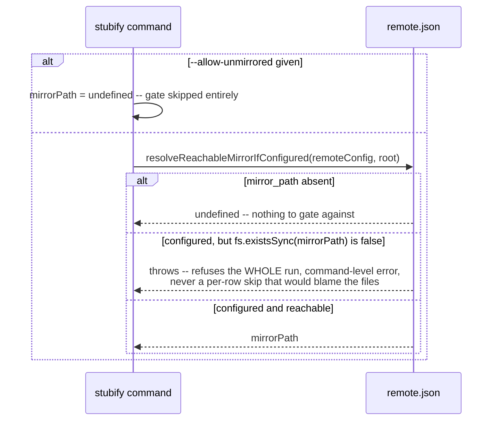

# `sync1 stubify`

**Derived from:** `src/commands/stubify.ts`, `src/fs/stubify.ts`

Replaces every fully-committed real file matching a glob with a stub. Needs no password — it reads only
`row.hash` off the cache row it already has. Crash safety mirrors `materialize`'s, in reverse: the stub
is written first (atomically), the real file deleted only after — an interrupted run lands in the safe
"both exist" state. Runs after the ordinary lock/root-resolution preamble (see
[`flow-preamble.md`](flow-preamble.md)), omitted below since it never varies.

## Sequence — the mirror gate (command-level precondition)

Runs once, before the glob scan even starts — a precondition on the whole run, not a per-row check (see
[`flow-mirror-metadata.md`](flow-mirror-metadata.md)'s notes for why this differs from `sync`/`gc`'s own
mirror resolution).



## Sequence — the glob scan (`processRow`)

```mermaid
sequenceDiagram
    participant Loop as glob scan
    participant FS
    participant Mirror as mirror (fs)
    participant Hash as hash pool
    participant Cache as cache.db

    Loop->>Loop: start enumerateStubifyWork -- NOT awaited, see flow-enumeration-pass.md

    loop each glob-matched row
        alt not a file
            Loop->>Loop: skip, uncounted
        else under a _thumbnail/ dir
            Loop->>Loop: stats.thumbnailDirExcluded++ -- never a materialize/stubify candidate
        else no real file on disk
            Loop->>Loop: stats.alreadyStub++
        else row.state != "unchanged"
            Loop->>Loop: skipped.push("not fully committed")
        else mirrorPath given AND !isMirrored(mirrorPath, row)
            Loop->>Mirror: mirrorObjectExists(mirrorObjectPath(hash), encryptedSize) -- one stat
            Loop->>Loop: skipped.push("not yet mirrored -- run mirror catchup, or --allow-unmirrored")
        else current mtime == row.mtime (fast path)
            Loop->>Loop: finalize(row.hash) -- see below, no rehash
        else mtime changed -- must rehash
            Loop->>Hash: hashJobs.dispatch(rehash)
            alt rehash != row.hash
                Hash-->>Loop: skipped.push("file changed since last synced -- run sync first")
            else confirmed
                Hash-->>Loop: finalize(rehash)
            end
        end
    end

    Loop->>Hash: await hashJobs.onIdle()
```

`finalize(hash)`: `writeStubAtomic(stubPath, hash)` (write the stub first) → `fs.rmSync(realFile)` (only
then delete the real file) → `cacheRepo.upsert({...row, mtime: stub's own mtime})` →
`stats.stubified++`.

## Output

```json
{
  "ok": true,
  "stubified": 2,
  "already_stub": 0,
  "thumbnail_dir_excluded": 0,
  "skipped": [{ "path": "notes.txt", "reason": "not fully committed (has pending local changes)" }]
}
```

`ok` is `false` whenever anything was skipped, even though every path that _could_ be stubbed still was.
Exit code non-zero on `ok: false`, on a filesystem error, or on the mirror-unreachable command-level
error above.

## Notes

- **Concurrency:** the glob scan is sequential; only a genuine rehash (mtime changed) dispatches to
  `hashRunner` via `BoundedTaskTracker` (see [`flow-pool-dispatch.md`](flow-pool-dispatch.md)). A second,
  concurrent enumeration pass estimates the progress denominator (see
  [`flow-enumeration-pass.md`](flow-enumeration-pass.md)).
- **The mirror check is a command-level precondition, not a per-row check, and that distinction is
  load-bearing.** `mirrorObjectExists` maps `ENOENT` to `false` uniformly, indistinguishable between
  "this content genuinely isn't mirrored yet" and "the entire mirror just vanished" (an unmounted
  drive). Left as a per-row check alone, unplugging the mirror would report every row as "not yet
  mirrored" (blaming the files) and still exit non-zero for the _right_ reason but the _wrong_ stated
  cause — worse, prior to this branch's own fix, `stubify` didn't even set a non-zero exit code for a
  skip at all (see `docs/cli/stubify.md`'s Exit codes section). The fix is one `fs.existsSync` check up
  front, in `resolveReachableMirrorIfConfigured`, refusing the whole run before any row is touched.
- **The mirror gate is mostly redundant by construction, and deliberately so.** Under the default
  `--on-mirror-max-retries fail` (sync's own flag), a mirror write that fails also fails the object, so
  its cache row never reaches `unchanged` and this command would skip it anyway via the ordinary
  "not fully committed" check. The gate exists for the two cases that escape that: content committed
  before `mirror_path` was configured, and a `sync` run made with `--skip-mirror` or
  `--on-mirror-max-retries ignore`.
- **A `_thumbnail/` row is excluded before any stat or mirror check runs** — a thumbnail previews a
  deliberately-unmaterialized original, so stubifying the preview itself would defeat that.
- **On failure:** a per-row skip never touches the filesystem for that row — the real file and any
  existing stub are left exactly as they were. A rehash mismatch (file changed since last synced) is
  reported the same way, not treated as corruption — the fix is `sync`, not a retry of `stubify`.
- **Sub-flows:** [`flow-pool-dispatch.md`](flow-pool-dispatch.md), [`flow-enumeration-pass.md`](flow-enumeration-pass.md),
  [`flow-atomic-publish.md`](flow-atomic-publish.md) (`writeStubAtomic`, the stub write itself).
