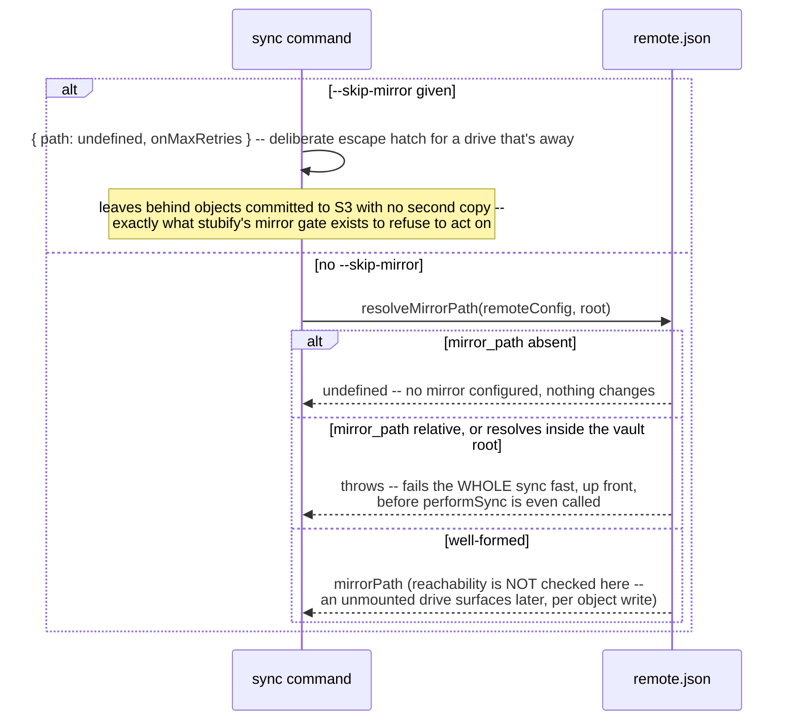

# `sync1 sync`

**Derived from:** `src/commands/sync.ts`, `src/sync/commit.ts`

`sync` is the bidirectional command: it folds this machine's local edits into the vault and pulls down
everything genuinely new from remote, in one run, ending in at most one new committed version. It runs
in **three sequential phases** — scan, upload, download — each reporting its own progress from zero
(there is no single combined bar or ETA: phase 2 works on the dirty set phase 1 produces, and phase 3
diffs against a candidate database that doesn't exist until the remote snapshot is fetched, so no
combined total could ever have been known up front).

## Sequence

```mermaid
sequenceDiagram
    participant User
    participant Preamble as flow-preamble
    participant CLI as sync command
    participant Unlock as flow-unlock-vault
    participant UpdateCache as update_cache
    participant CandidateFlow as flow-candidate-db

    User->>Preamble: sync1 sync [--root] [--verify-remote] [--skip-mirror]<br/>[--on-mirror-max-retries fail|ignore]
    note over Preamble: lock + root resolution + stale temp sweep -- see flow-preamble.md
    Preamble->>CLI: run handler

    CLI->>CLI: resolveRoot(opts.root) -- again, independently (see flow-preamble.md's own note)
    CLI->>Unlock: getPassword + parseManifest + unlockVault -- see flow-unlock-vault.md
    CLI->>CLI: createS3Client; resolve mirror options (see below)
    CLI->>CLI: createConcurrencyPools; start a bytes-progress session (one bar per phase)

    CLI->>CLI: performSync(root, masterKey, s3, pools, mirror, verifyRemote flag)
    CLI->>CLI: read last_synced_version
    CLI->>CLI: verifyRemote = --verify-remote OR upload-in-progress marker already present<br/>(an earlier run's own leftover, checked before this run writes its own copy)

    CLI->>UpdateCache: performUpdateCache(...) -- phase "scanning"
    note over UpdateCache: opens local state.db READ-ONLY (no password needed for that)<br/>only to validate stub-declared hashes against known objects.<br/>Full mechanics: update_cache.md
    UpdateCache-->>CLI: updateCacheStats (caseCollisions, droppedIgnored, ...)

    CLI->>CLI: dirtyCount = cacheRepo.countDirty()

    CLI->>CandidateFlow: everything from here through the commit --<br/>see flow-candidate-db.md for the full GET-/current /<br/>remote-fresh-fetch / apply-local / apply-remote / CAS sequence
    CandidateFlow-->>CLI: { versionStamp, uploadedObjects, dedupedObjects,<br/>mirroredObjects, mirrorFailures, localEntriesChanged,<br/>remoteCreated/Modified/Deleted, conflicts, ignoredButSynced }

    CLI-->>User: JSON or plain-text summary; exit code (see Output below)
```

## Resolving the mirror options



## Output

`ok` is `false` whenever `conflicts`, `caseCollisions`, or `failed` is non-empty. Exit code:
`EXIT_CONFLICT` when `conflicts` or `caseCollisions` is non-empty (regardless of `failed`);
`EXIT_GENERIC_ERROR` when only `failed` is. `failed` is `ApplyLocalChangesResult.failed`
(`apply-local-changes.ts`) passed straight through `SyncResult` -- one entry per path whose upload was
swallowed by the per-object catch there rather than escalated (the escalated case, `MirrorRequiredError`,
is covered below). `mirrorFailures > 0` under `--on-mirror-max-retries ignore` is, by contrast, never a
failure: the object committed, and `mirror catchup` (not a `sync` re-run) is the fix.

A thrown `RemoteDivergedError`
(the CAS genuinely lost a race — see [`flow-cas-commit.md`](flow-cas-commit.md), Shape 1) also exits
`EXIT_CONFLICT`; every other thrown error maps through `exitCodeForError`, which includes
`MirrorRequiredError` — a mirror write that exhausted its retries under the default
`--on-mirror-max-retries fail` (see [`flow-apply-local-changes.md`](flow-apply-local-changes.md)) — since
it isn't one of `exitCodeForError`'s own special cases and so falls through to the generic exit `1`.
Unlike `mirrorFailures`, this never reaches the summary at all: nothing was committed, so `performSync`
never returns a result for `runSync` to report — the CLI's own catch block emits `{ ok: false, error }`
instead.

## Notes

- **Concurrency:** each phase creates and drains its own pool work (`update_cache`'s hash pool during
  scanning; `pools.stream`, shared by both the upload and download phases, bounded independently in
  each — see [`flow-pool-dispatch.md`](flow-pool-dispatch.md)). The three phases themselves are strictly
  sequential — phase 2 needs phase 1's dirty set, phase 3 needs phase 2's candidate.
- **A version-stamp match does not mean "nothing to sync."** Right after `attach_remote`, local
  `state.db` is fully populated but `cache.db` is empty — the real answer always comes from diffing
  `cache.db` against the candidate, never from comparing stamps alone. This is why `performSync` never
  short-circuits on `!remoteHasMoved && dirtyCount === 0`.
- **A version is only committed if something actually mutated `entries`/`objects`.** A run where every
  dirty row resolved as a no-op (see `conflict-rules.ts`) has nothing new worth uploading — remote-only
  changes are still pulled down and the local baseline still advances, but that's a plain adoption, not
  a commit (see the `willCommit` branch in [`flow-candidate-db.md`](flow-candidate-db.md)).
- **`--verify-remote` and the marker together are the recovery path for an aborted upload.** A run whose
  own upload phase (or anything after it, through the candidate actually being promoted) gets killed
  leaves objects on S3 that no local state knows about — the candidate DB that would have recorded them
  is discarded along with everything else. The marker's mere presence at the _start_ of a later run is
  the signal that this might have happened; `--verify-remote` forces the same HEAD-before-upload check
  unconditionally, at the cost of one HEAD per upload.
- **On failure:** see [`flow-preamble.md`](flow-preamble.md) for what a killed process leaves behind
  before this command's own handler even runs, and [`flow-candidate-db.md`](flow-candidate-db.md) for
  everything after — including why a `CasConflictError` deliberately leaves the upload-in-progress
  marker in place rather than clearing it.
- **Composes:** [`flow-preamble.md`](flow-preamble.md), [`flow-unlock-vault.md`](flow-unlock-vault.md),
  [`update_cache.md`](update_cache.md) (phase 1), [`flow-candidate-db.md`](flow-candidate-db.md) (phases
  2–3 plus the commit, which in turn composes
  [`flow-apply-local-changes.md`](flow-apply-local-changes.md),
  [`flow-apply-remote-changes.md`](flow-apply-remote-changes.md),
  [`flow-cas-commit.md`](flow-cas-commit.md) Shape 1, and [`flow-mirror-metadata.md`](flow-mirror-metadata.md)).
